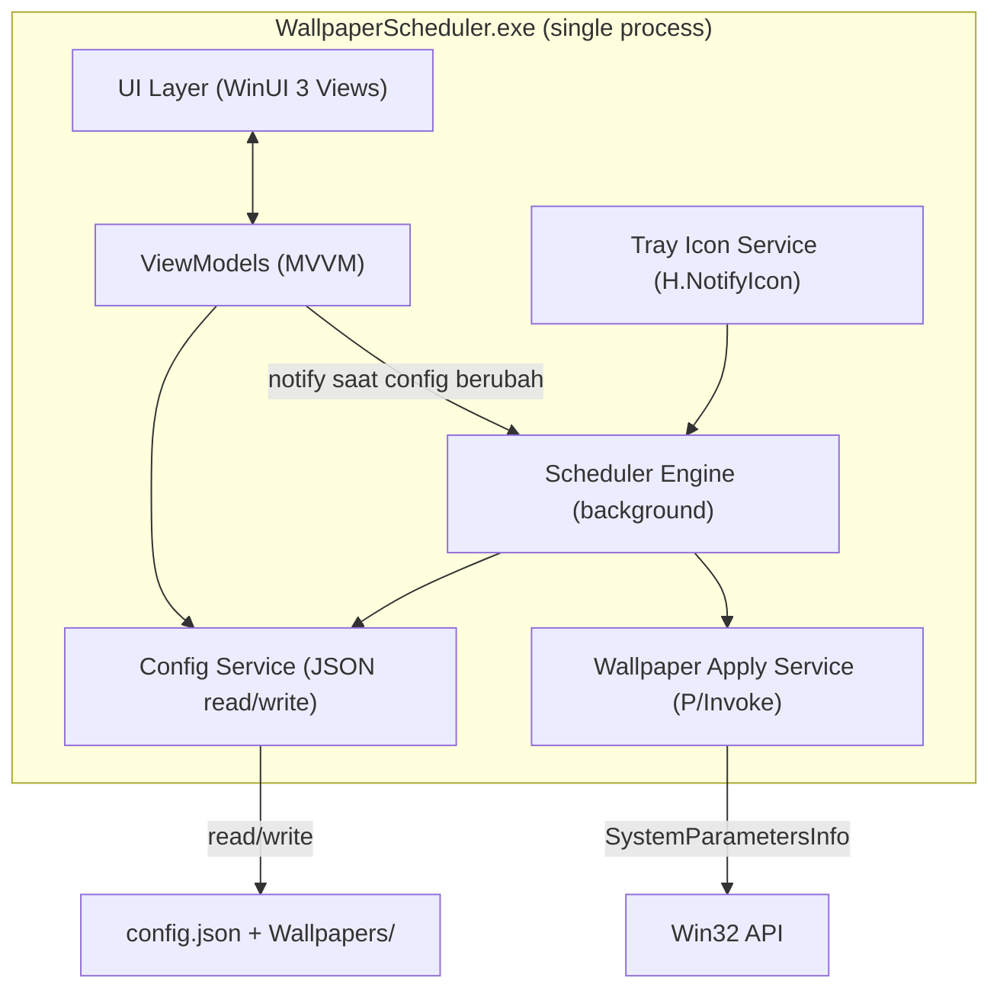

# Architecture — Wallpaper Scheduler

## 1. Prinsip Desain

- **Single process.** Gak ada Windows Service terpisah + app UI terpisah. Alasannya teknis, bukan sekadar simpel-simpelan: lihat section 2.
- **Event-driven scheduler, bukan polling.** Timer dihitung ulang tiap kali ada event, bukan cek kondisi tiap N detik. Ini kunci utama biar CPU idle mendekati 0%.
- **Data lokal, format sederhana.** JSON file, bukan database. Ukuran data kecil (puluhan-ratusan entry paling banyak), gak butuh query engine.
- **Portable, no elevation.** Semua operasi (install, autostart, tulis file) di scope user (HKCU, `%LOCALAPPDATA%`), gak pernah minta admin.

## 2. Kenapa Single Process (bukan Windows Service)?

Ini keputusan penting yang perlu didokumentasikan biar gak salah arah pas implementasi.

Windows Service jalan di **Session 0**, terisolasi dari desktop session user (sejak Windows Vista, "Session 0 Isolation"). API buat ganti wallpaper (`SystemParametersInfo` dengan `SPI_SETDESKWALLPAPER`) **harus** dipanggil dari dalam interactive user session — kalau dipanggil dari Session 0, gak ada efek apa-apa karena gak ada desktop yang "punya" wallpaper itu.

Konsekuensinya: pendekatan Windows Service tradisional gak akan jalan buat use case ini tanpa kerumitan tambahan (butuh service + companion app di user session + IPC antara keduanya). Itu over-engineering buat app sekecil ini.

**Solusi**: satu aplikasi WinUI 3 yang jalan di user session, dengan scheduler engine berupa background task/thread di dalam process yang sama. App ini yang pegang tray icon sekaligus yang jalanin logic scheduling. Simpel, efisien, dan gak ada masalah session isolation karena dari awal udah jalan di context yang benar.

## 3. High-Level Architecture



Semua komponen ini hidup di satu process. Scheduler dan UI berbagi `ConfigService` yang sama sebagai single source of truth (in-memory, disinkron ke disk tiap ada perubahan).

## 4. Scheduler Engine — Event-Driven Timer

Ini bagian paling kritis buat requirement efisiensi (NFR-1).

### Alur kerja:

1. Saat startup (atau tiap kali config berubah), scheduler **resolve** wallpaper mana yang seharusnya aktif *sekarang*, lalu apply kalau beda dari yang sedang terpasang.
2. Scheduler hitung **waktu event berikutnya** — waktu paling dekat di mana wallpaper aktif harus berubah. Ini bisa jadi:
   - Waktu selesai time slot yang sedang aktif, ATAU
   - Tengah malam (00:00) — karena override tanggal bisa berubah begitu hari berganti, walau sedang di tengah slot yang "kelihatannya" masih lama
   - Dipilih yang **paling cepat** di antara keduanya.
3. Scheduler set satu `System.Threading.Timer` (atau `DispatcherTimer` kalau perlu akses UI thread) yang fire persis di waktu itu.
4. Pas timer fire → re-resolve wallpaper aktif → apply kalau perlu → hitung ulang next event → set timer baru. Ulangi.

Dengan pola ini, thread scheduler **tidur** (gak makan CPU) di antara dua event, dan cuma "bangun" pas benar-benar ada perubahan wallpaper yang perlu di-apply. Ini jauh lebih efisien dibanding polling tiap detik/menit buat cek "sekarang jam berapa, ada slot aktif gak".

### Extra trigger (di luar timer normal):

- **System resume from sleep** — subscribe ke `SystemEvents.PowerModeChanged` (Microsoft.Win32), pas event `Resume` → langsung re-resolve & re-apply. Ini jaga-jaga kalau komputer sleep melewati beberapa event yang harusnya kejadian.
- **Config berubah dari UI** — ViewModel notify Scheduler (lewat event/callback), scheduler langsung re-resolve dan reset timer, biar perubahan jadwal langsung kepakai tanpa nunggu restart app.
- **System time berubah manual** — opsional, subscribe `SystemEvents.TimeChanged` buat re-resolve, jaga-jaga user ubah jam sistem manual.

## 5. Priority Resolution (ringkas — detail algoritma di `design.md`)

```
Specific Date Override (match tanggal exact)
        ↓ kalau gak ada match
Monthly Recurring Override (match tanggal-dalam-bulan)
        ↓ kalau gak ada match
Weekly Schedule (base/default, match hari-dalam-minggu)
```

Setiap slot membawa `WallpaperStyle` sendiri (per-slot). Resolver mengembalikan
`(wallpaperId, style)`; style efektif = style slot, fallback ke setting global.
Style `Custom` memakai area crop yang tersimpan di `WallpaperItem` (lihat section 6).

Perubahan pada slot yang sedang aktif (hari/tanggal hari ini) langsung memicu
re-evaluate **force** — wallpaper aktif di-apply ulang kalau wallpaper/style-nya
berubah, tanpa menunggu event berikutnya.

## 6. Wallpaper Apply Layer & Transition Effects

- **Penyimpanan Gambar**: Saat import, file gambar **disalin** ke `%LOCALAPPDATA%\WallpaperSchedule\Wallpapers\` dengan nama acak (`{guid}{ext}`) dan direferensikan lewat `FileName`. Path lokal dipakai supaya file tidak hilang kalau file asli user dipindah/hapus. Thumbnail digenerate otomatis ke `%LOCALAPPDATA%\WallpaperSchedule\Thumbs\{id}.jpg`.
- **Hybrid Render (base + frame)**:
  - **Native wallpaper (base layer)**: di-set via `IDesktopWallpaper` (COM) atau fallback `SystemParametersInfo(SPI_SETDESKWALLPAPER)`. Ini lapisan dasar yang selalu benar walaupun frame gagal attach.
  - **Frame layer (di atas native, di belakang ikon desktop)**: `WallpaperFrameService` membuat raw Win32 child window yang di-parent ke `WorkerW` (teknik yang sama dengan Wallpaper Engine/Lively, via pesan `0x052C` ke Progman). GDI+ menggambar gambar wallpaper di window ini. Kenapa raw Win32 dan bukan XAML: reparenting WinUI 3 Window tidak didukung, dan `DesktopWindowXamlSource` butuh parent HWND satu thread — keduanya tidak cocok dengan WorkerW milik explorer.
  - **Transisi**: saat wallpaper berganti, frame melakukan crossfade — gambar lama fade-out bersamaan gambar baru fade-in selama ±500ms (DispatcherTimer, alpha naik bertahap). Native wallpaper di-set dulu sebagai base, frame menimpa dengan animasi di atasnya.
- **System API**: Menggunakan P/Invoke ke `IDesktopWallpaper` atau `SystemParametersInfo` dengan flag `SPI_SETDESKWALLPAPER` agar perubahan wallpaper tersimpan di sistem Windows.
- **Wallpaper Style**: Style efektif per slot — `TimeSlot.WallpaperStyle` (kosong = ikuti setting global). Style (Fill/Fit/Stretch/Tile/Center/Span) diset di registry `HKCU\Control Panel\Desktop` sebelum menerapkan wallpaper baru.
- **Custom Style**: Kalau style efektif = `Custom`, `CropHelper.GenerateCustom` memotong area crop tersimpan di `WallpaperItem` (ternormalisasi 0–1) dari gambar sumber, men-skalanya ke **resolusi layar utama** (`GetSystemMetrics SM_CXSCREEN/SM_CYSCREEN`), menyimpan hasil ke `{id}_custom.bmp`, lalu diterapkan sebagai `Fill`. Area crop dipilih user lewat `CropSelector` (drag kotak & resize via pojok).

## 7. Data Layer

- **Konfigurasi**: Disimpan di `%LOCALAPPDATA%\WallpaperSchedule\config.json`.
- **Berkas Wallpaper**: Disimpan dalam bentuk referensi path asli (absolute path) di dalam properti `FileName` pada konfigurasi, sehingga tidak menduplikat berkas gambar berukuran besar.
- **Cache Thumbnail**: Dibuat secara otomatis di `%LOCALAPPDATA%\WallpaperSchedule\Thumbnails\` dengan nama file berbasis properti unik `Id` dari setiap `WallpaperItem` (`{id}.jpg`) untuk menghindari tabrakan nama file (collision) dari direktori asal yang berbeda.
- **Write Atomic**: Penyimpanan konfigurasi dilakukan secara atomic dengan menulis ke file `.tmp` terlebih dahulu sebelum melakukan replace, guna mencegah kerusakan data jika proses terhenti di tengah jalan.
- Struktur detail schema JSON ada di `design.md`.

## 8. System Tray

- Pakai library `H.NotifyIcon.WinUI` (community package yang umum dipakai buat tray icon di WinUI 3, karena WinUI 3 sendiri gak punya native support buat ini).
- Menu tray minimal: **Buka Aplikasi**, separator, **Pause/Resume Schedule**, separator, **Keluar**.
- Icon tray bisa berubah state (misal beda warna/badge) buat indikasi scheduler lagi paused vs aktif — nice-to-have, bukan blocking.

## 9. Auto-Start

- Karena unpackaged, autostart pakai **Registry Run key**: `HKCU\Software\Microsoft\Windows\CurrentVersion\Run`, bukan Task Scheduler atau Startup folder — paling simpel, gak butuh admin, standar buat app portable.
- Value-nya path ke exe + argumen `--tray` (atau nama argumen serupa) supaya app langsung start minimized ke tray tanpa flash window utama.
- Toggle di Settings tinggal add/remove registry value ini.

## 10. Project Structure

```
WallpaperScheduler/
├── App.xaml / App.xaml.cs           # entry point, startup args handling (--tray)
├── MainWindow.xaml / MainWindow.xaml.cs  # nav shell + tray icon & menu
├── Views/
│   ├── OverviewPage.xaml            # current wallpaper, default wallpaper, summary
│   ├── WeeklySchedulePage.xaml      # per-day slot editor
│   ├── MonthlyOverridesPage.xaml    # month calendar (kiri) + slots (kanan)
│   ├── DateOverridesPage.xaml       # CalendarView (kiri) + slots (kanan)
│   ├── SettingsPage.xaml
│   ├── TimeSlotRow.xaml             # shared slot card (dipakai Monthly/Dates)
│   └── CropSelector.xaml            # custom crop-area editor
├── ViewModels/
│   ├── MainViewModel.cs
│   ├── OverviewViewModel.cs
│   ├── WeeklyScheduleViewModel.cs
│   └── SettingsViewModel.cs
├── Services/
│   ├── SchedulerEngine.cs           # background timer logic (section 4)
│   ├── WallpaperApplyService.cs     # IDesktopWallpaper / SystemParametersInfo
│   ├── WallpaperFrameService.cs     # WorkerW frame layer + crossfade
│   ├── ConfigService.cs             # load/save JSON (atomic), in-memory model
│   ├── ThemeService.cs              # apply app theme (system override)
│   └── AutoStartService.cs          # registry Run key management
├── Models/
│   └── AppConfig.cs                 # semua model (settings, library, schedule, override)
├── Helpers/
│   ├── ScheduleResolver.cs          # priority resolution logic (murni, testable)
│   ├── WallpaperImport.cs           # file picker + copy ke Wallpapers/
│   ├── ThumbnailGenerator.cs        # generate thumbnail {id}.jpg
│   └── CropHelper.cs                # custom crop (GenerateCustom + EditCropAsync)
└── Assets/
```

Pola **MVVM** dipakai konsisten (standar buat WinUI 3), pakai `CommunityToolkit.Mvvm` buat `ObservableObject`, `RelayCommand`, dsb — biar boilerplate minim.

`ScheduleResolver` sengaja dipisah jadi class murni (gak depend ke Win32 API atau UI) biar gampang di-unit-test — logic priority resolution ini yang paling penting buat bener, jadi worth di-test terpisah dari efek sampingnya (apply wallpaper beneran).

## 11. Yang Perlu Divalidasi Saat Implementasi

- Actual RAM footprint WinUI 3 app saat idle (runtime WinUI 3 ada overhead-nya, perlu diukur langsung, bukan cuma diasumsikan dari desain).
- Perilaku `SystemParametersInfo` di multi-monitor setup real (walau sudah confirm "sama semua monitor", perlu dicek gimana Windows treat ini di setup dual/triple monitor beda resolusi).
